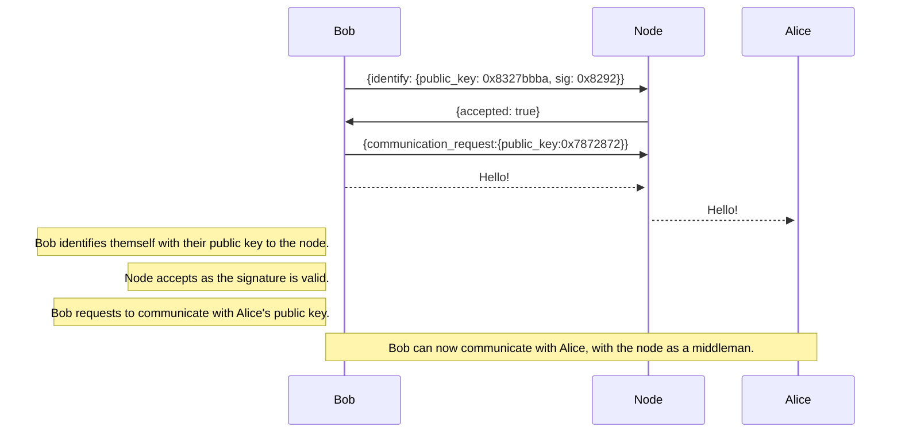

## Cacophoney
A chat application that has all the features of Discord, but decentralized and more private. This repository is for a cacophoney node, which communicates with clients.

## Features
These are the features that will be added or currently existing:

- [ ] Base application
- [ ] Terminal GUI \(Sort of done)
- [ ] HTTP/WebSockets proxy to allow browsers to connect
- [ ] WebRTC support for voice calling
- [ ] File upload support
- [ ] Client side application

    - [ ] Tauri/Svelte GUI
    - [ ] Basic Messaging functionality
    - [ ] Group chat support
    - [ ] "Server" or "Guild" support \(similar to existing Discord servers)

## How it works (communication protocl)

## License
This work is licensed under the [Apache 2.0](/LICENSE) or [MIT](/LICENSE-MIT) license at your option.
